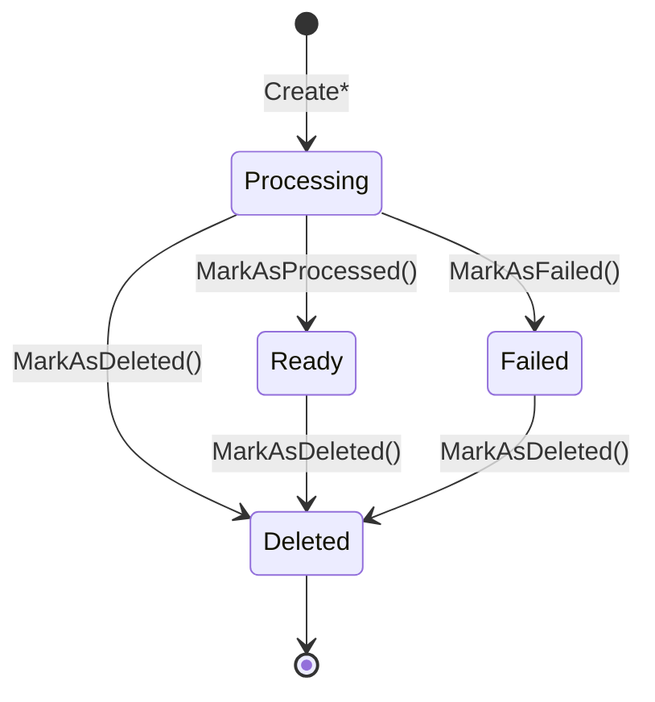

# Domain Model Documentation

## Overview
This document provides detailed documentation of the Screenshot Manager domain model, including entities, value objects, and their relationships.

## Domain Model Diagram

```
┌─────────────────────────────────────────────────────────────┐
│                     Domain Model                           │
├─────────────────────────────────────────────────────────────┤
│                                                             │
│  ┌─────────────────────┐     ┌─────────────────────────┐     │
│  │    Screenshot       │     │   BlobReference         │     │
│  │    (Entity)         │────▶│   (Value Object)        │     │
│  │                     │     │                         │     │
│  │ - Id: Guid          │     │ - ContainerName: string │     │
│  │ - DisplayName       │     │ - BlobName: string      │     │
│  │ - BlobName          │     │ - FullUri: Uri          │     │
│  │ - CreatedAt         │     │                         │     │
│  │ - Source            │     └─────────────────────────┘     │
│  │ - Status            │                                     │
│  │ - ExtractedText     │                                     │
│  │ - Tags              │                                     │
│  │ - FailureReason     │                                     │
│  └─────────────────────┘                                     │
│           │                                                 │
│           │                                                 │
│  ┌─────────────────────┐     ┌─────────────────────────┐     │
│  │  ScreenshotSource   │     │  ScreenshotStatus       │     │
│  │  (Enum)             │     │  (Enum)                 │     │
│  │                     │     │                         │     │
│  │ - Clipboard         │     │ - Processing            │     │
│  │ - FileUpload        │     │ - Ready                 │     │
│  │ - DragDrop          │     │ - Failed                │     │
│  │ - API               │     │ - Deleted               │     │
│  └─────────────────────┘     └─────────────────────────┘     │
│                                                             │
└─────────────────────────────────────────────────────────────┘
```

## Entities

### Screenshot Entity

The `Screenshot` entity is the core aggregate root of the domain model, representing a screenshot image with its associated metadata and processing status.

#### Properties

| Property | Type | Description | Validation |
|----------|------|-------------|------------|
| `Id` | `Guid` | Unique identifier for the screenshot | Auto-generated |
| `DisplayName` | `string` | Human-readable name for the screenshot | Required, not empty |
| `BlobName` | `string` | Storage identifier in blob storage | Required, not empty |
| `CreatedAt` | `DateTime` | UTC timestamp when screenshot was created | Auto-set to UTC now |
| `Source` | `ScreenshotSource` | How the screenshot was created | Set by factory method |
| `Status` | `ScreenshotStatus` | Current processing status | Starts as Processing |
| `ExtractedText` | `string?` | AI-extracted text content (Walk+ feature) | Optional |
| `Tags` | `List<string>` | AI-generated tags (Walk+ feature) | Optional |
| `FailureReason` | `string?` | Reason for failure if status is Failed | Set when marking as failed |

#### Business Rules

1. **Immutable Identity**: Once created, the `Id`, `CreatedAt`, `Source`, and `BlobName` cannot be changed
2. **Status Lifecycle**: Screenshots follow a specific status lifecycle:
   ```
   Processing → Ready (success path)
   Processing → Failed (error path)
   Any Status → Deleted (deletion path)
   ```
3. **Validation Rules**:
   - Display name cannot be null, empty, or whitespace
   - Blob name cannot be null, empty, or whitespace
   - Failure reason must be provided when marking as failed
4. **Operational Rules**:
   - Deleted screenshots cannot be modified
   - AI analysis can only be added to non-deleted, non-failed screenshots
   - Status transitions are controlled through specific methods

#### Factory Methods

The entity uses factory methods to ensure proper initialization based on the source:

```csharp
Screenshot.CreateFromClipboard(displayName, blobName)
Screenshot.CreateFromUpload(displayName, blobName)
Screenshot.CreateFromDragDrop(displayName, blobName)
Screenshot.CreateFromAPI(displayName, blobName)
```

#### State Transitions



## Value Objects

### BlobReference Value Object

The `BlobReference` value object encapsulates the complete reference to a blob in Azure Blob Storage.

#### Properties

| Property | Type | Description | Validation |
|----------|------|-------------|------------|
| `ContainerName` | `string` | Name of the blob container | Required, not empty |
| `BlobName` | `string` | Name of the blob file | Required, not empty |  
| `FullUri` | `Uri` | Complete URI to the blob | Required, valid URI |

#### Characteristics

1. **Immutability**: All properties are read-only after construction
2. **Value Equality**: Two instances are equal if all properties match
3. **Self-Validation**: Constructor validates all inputs
4. **Hash Code Consistency**: Implements proper hash code for use in collections

## Enums

### ScreenshotSource Enum

Defines the method by which a screenshot was created:

| Value | Description |
|-------|-------------|
| `Clipboard` | Screenshot created from clipboard paste |
| `FileUpload` | Screenshot uploaded as a file |
| `DragDrop` | Screenshot added via drag and drop |
| `API` | Screenshot created via API call |

### ScreenshotStatus Enum

Defines the current processing status of a screenshot:

| Value | Description |
|-------|-------------|
| `Processing` | Initial state, screenshot is being processed |
| `Ready` | Screenshot is processed and ready for use |
| `Failed` | Screenshot processing failed |
| `Deleted` | Screenshot has been marked for deletion |

## Domain Events

While not implemented in the current version, the domain model is designed to support domain events for the following scenarios:

1. **ScreenshotCreated**: When a new screenshot is created
2. **ScreenshotProcessed**: When a screenshot processing completes
3. **ScreenshotFailed**: When a screenshot processing fails
4. **ScreenshotDeleted**: When a screenshot is marked as deleted
5. **AIAnalysisCompleted**: When AI analysis is added to a screenshot

## Business Invariants

1. **Entity Consistency**: A Screenshot must always have a valid ID, display name, and blob name
2. **Status Consistency**: Status transitions must follow the defined lifecycle
3. **Temporal Consistency**: CreatedAt timestamp must be in the past
4. **Reference Integrity**: BlobName should correspond to an actual blob in storage
5. **AI Analysis Integrity**: AI analysis can only exist on successfully processed screenshots

## Usage Patterns

### Creating Screenshots
```csharp
// From clipboard
var screenshot = Screenshot.CreateFromClipboard("My Screenshot", "blob-12345");

// From upload
var screenshot = Screenshot.CreateFromUpload("Uploaded Image", "blob-67890");
```

### Processing Lifecycle
```csharp
// Start processing (screenshot created in Processing state)
var screenshot = Screenshot.CreateFromClipboard("Test", "blob-123");

// Success path
screenshot.MarkAsProcessed();
screenshot.AddAIAnalysis("Extracted text", new[] { "tag1", "tag2" });

// Error path
screenshot.MarkAsFailed("Invalid image format");
```

### Status Queries
```csharp
if (screenshot.IsReady && screenshot.HasAIAnalysis)
{
    // Process the completed screenshot with AI data
}
```

## Extension Points

The domain model is designed for extensibility:

1. **Additional Sources**: New `ScreenshotSource` values can be added
2. **Extended Metadata**: Additional properties can be added to the Screenshot entity
3. **Rich AI Analysis**: The AI analysis structure can be expanded beyond simple text and tags
4. **Domain Events**: Event-driven architecture can be layered on top
5. **Validation Rules**: Business rules can be externalized to a rules engine

## Performance Considerations

1. **Value Object Caching**: BlobReference instances can be cached due to immutability
2. **Lazy Loading**: AI analysis data could be loaded separately if it becomes large
3. **Indexing**: Common query patterns suggest indexes on Status, CreatedAt, and Source
4. **Batch Operations**: The model supports batch processing of multiple screenshots

---

**Last Updated**: June 18, 2025  
**Version**: 1.0  
**Related Documents**: 
- [Component Architecture](../../05-COMPONENT_ARCHITECTURE.md)
- [Domain Component README](../README.md)